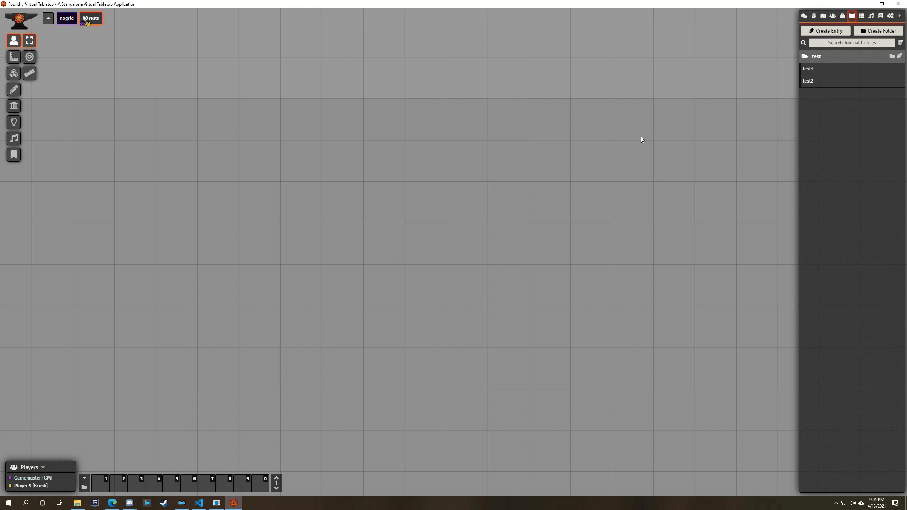

# DFreds Droppables

__DFreds Droppables__ is a FoundryVTT module which allows you to drag and drop an entire folder of tokens or journal entries onto the canvas.

## Let Me Sell You This

Have you ever needed to drop all of your pesky players onto a scene at once? Have you ever created dozens of room notes and _dreaded_ the thought of dragging them all out onto the map one by one like some kind of peasant? Well, now you don't have to. Yay mild conveniences.

## What This Module Does

On the drag and drop of an actor folder or journal entries folder onto the canvas, Droppables creates tokens (for actors) or notes (for journal entries) for each item in that folder. Note that it will not do anything for any subfolders, as that could get sort of insane if you're OCD like me and everything has subfolders on subfolders. Anyway...

## The Elephant in the Room

This feature was actually implemented in [The Furnace](https://github.com/League-of-Foundry-Developers/fvtt-module-furnace). However, the Furnance has been confirmed abandoned by the good folks over at the League of Extraordinary Foundry Developers. You might consider this the first step to replacing the features previously contained in that module.

### libWrapper

This module uses the [libWrapper](https://github.com/ruipin/fvtt-lib-wrapper) library for wrapping core methods. While this is not a hard dependency, it is recommended to install it for the best experience and compatibility with other modules.

## My Philosophy

I've noticed over the months that a lot of FoundryVTT modules lack focus and good coding practice. A user should never be in a situation where they forget what any given module does. Additionally, a power user should never be totally lost on what's going on in a module if they dive into it.

In case anyone out there in the void is curious, this is my philosophy when it comes to implementing modules.

* Code should be easy to read, self-documenting, and contain JSDocs for any public functions
* Modules should do one thing, and one thing only. No "Quality of Life" catchalls from me. NO SIREE BOB.
* That thing the module does should do it well, with a minimum amount of initial configuration. It should "[Just Work](https://upload.wikimedia.org/wikipedia/commons/b/bf/ToddHoward2010sm_%28cropped%29.jpg)".
* Additional configuration should only be added if it really makes sense. If the configuration starts to change the thing the module does well, it shouldn't be there.
* Readmes (like this) should be funny AND informative. Please create a pull request if you think it could be funnier or informativer.
